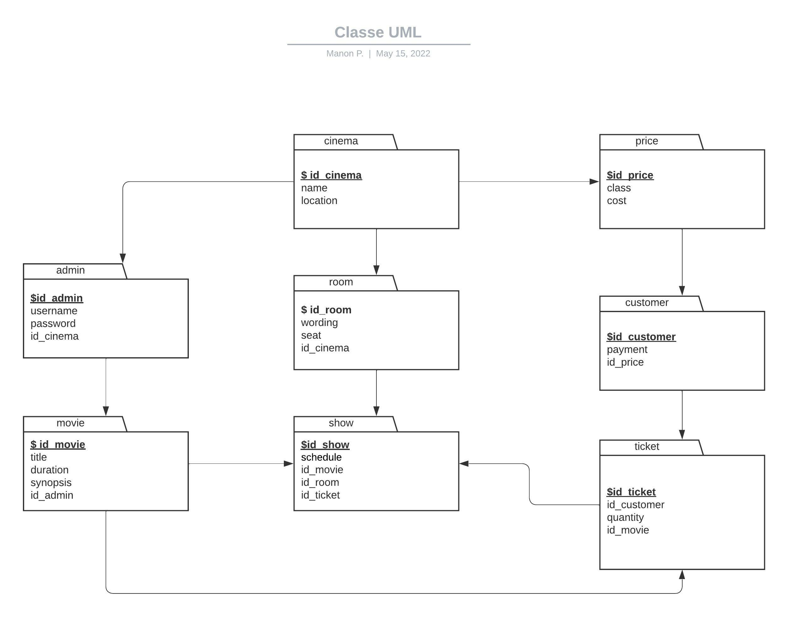
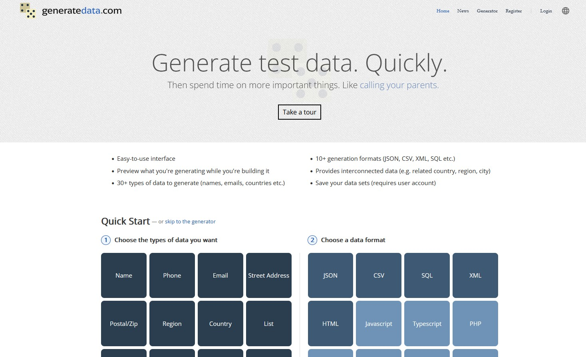
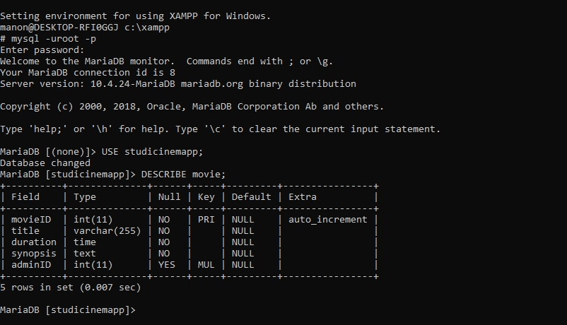
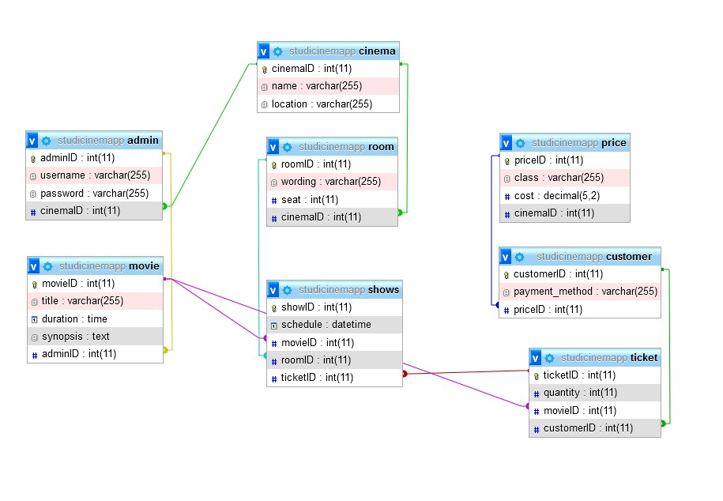

# Database for cinema
Created for an exam from STUDI by Manon POUCET

## Technologies used

    MySQL
    Powershell
    XAMPP
    PHPMyAdmin
    Generatedata.com
    Lucidchart.com

### Tasks

Compte tenu de la demande (une base de données relationnelle et un diagramme ULM), j'ai commencé par prendre connaissance de l'ensemble des attentes du client. Pour rappel :

"
* Est-ce qu’il y aura uniquement les séances d'un seul cinéma?
    Non. Nous sommes partenaires de plusieurs complexes, et donc nous aimerions qu'il soit possible de réserver au choix dans l'un d'entre eux.
* Dans un cinéma, peut-il y avoir le passage du même film au même horaire dans plusieurs salles différentes ?
    Oui, cela arrive dans certains de nos complexes pour les blockbusters les plus rentables !
* Désirez-vous que vos clients puissent choisir leur place?
    Pas nécessairement. Néanmoins, il faudra bien faire attention au nombre de places disponibles dans une salle!
* Quels tarifs possibles?
    - Plein tarif: 9€20
    - Étudiant: 7€60
    - Moins de 14 ans: 5€90
* Le paiement se fera sur place ou en ligne?
    Nous comptons à terme digitaliser nos tickets. S'il est possible de faire les deux, ce serait génial ! Sinon, nous nous contenterons pour l'instant d'un paiement sur place
* D'un point de vue back office, qui pourra inscrire les séances?
    Il nous faudrait un ou plusieurs administrateurs chez nous ayant une vue sur tout. Mais nous aimerions qu'un utilisateur par complexe ait les droits d'ajouter les séances de son propre cinéma
"

J'ai également pris en compte les contraintes qui étaient d'utiliser du script SQL dans un terminal uniquement, d'utiliser ce terminal pour réaliser l'export de la base de données créée, et de remplir les tables avec de fausses données.

Une fois cette étape réalisée, j'ai créé un diagramme UML à l'aide de LucidChart (site web gratuit de création de diagrammes) et j'ai commencé à me représenter l'ensemble des tables que j'aurais à créer dans ma base de données. J'ai relié ces tables entre elles pour comprendre lesquelles auraient besoin de clés étrangères. Puis, j'ai éditer cet UML afin de la transmettre au client, comme ci-dessous.

Tout d'abord, j'ai ouvert mon terminal Windows et j'ai commencé par identifier à mes bases de données. Pour cette exercice, j'ai conservé mes identifiants basiques mais dans un cadre professionnel, il aurait fallut que je créé un nouvel identifiant et surtout que je m'assure que mon mot de passe soit plus conséquent (lettres, majuscules, symboles, phrases avec des chiffres...) pour permettre de sécuriser parfaitement la base de données que j'ai ensuite créé.

Ensuite, à l'aide des commandes SQL, j'ai créé ma base de données : studicinemapp et j'ai utilisé USE studicinemapp; pour me rendre dessus.

J'ai ensuite créé les tables nécessaires en n'omettant pas les relations et contraintes (clés étrangères) entre mes tables.

L'ensemble de mes commandes sont répertoriées dans le fichier db-cinema.sql de ce dépôt github : 

Une fois mes tables éditées et reliées entre elles, j'ai pu inserer des fausses données comme demander par le client. Afin de réaliser cela, j'ai utiliser generatedata.com, un site permettant de générer de fausses données. Je n'avais plus qu'à réaliser ma commande via le cmd Windows, par exemple : INSERT INTO movie (title, duration, synopsis) VALUES... et à coller les données générées après VALUES.

Afin d'illustrer mes propos concernant mes commandes dans le cmd, voici une capture d'écran de celui-ci après un DESCRIBE movie;

Comme mysql est installé via le logiciel XAMPP, j'ai pu également m'assurer de mes créations de clés étrangères via PHPMyAdmin, cf capture d'écran ci-dessous :

Une fois la base de données prête et similaire à mon diagramme UML et donc aux attentes du client, j'ai réalisé un export de celle-ci, toujours à l'aide du cmd avec la commande mysqldump -uroot -p studicinemapp > dump.sql

Le fichier généré et à transmettre au client est visible depuis ce dépôt github également.

#### Context

J'ai réalisé ce projet dans le cadre de ma formation chez STUDI.